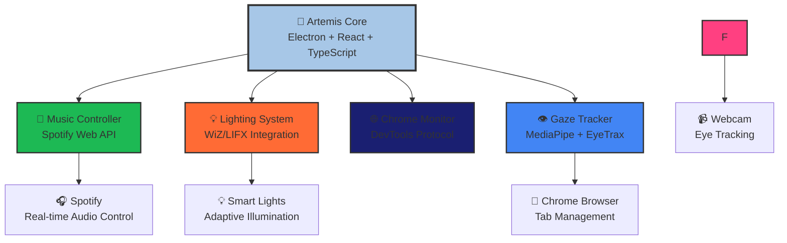
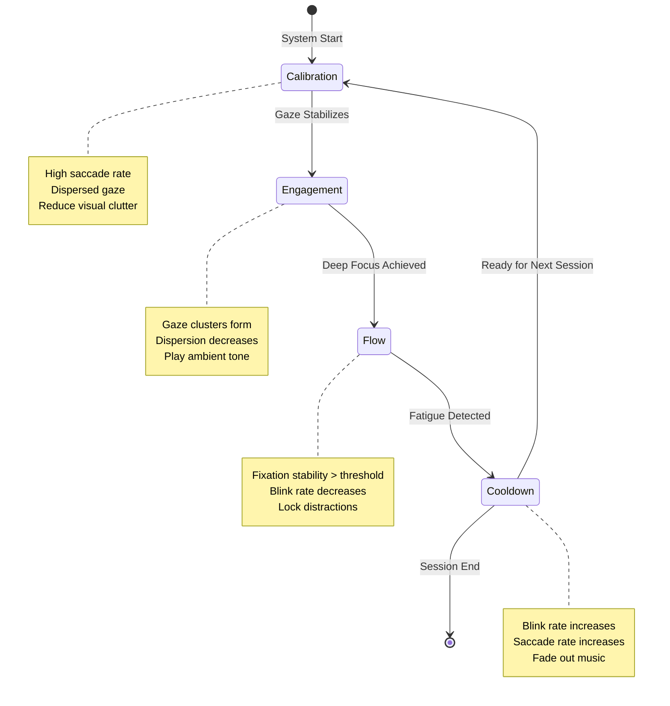

<div align="center">


# 🧠 Artemis: Designed for ADHD minds. Built for calm.

**Redefine Your Focus Strategy: Combat Distractions with Our Game-Changing AI Solution! Effortlessly Orchestrate Your Environment Through Real-Time Gaze Tracking-Experience Zero Cognitive Friction, Enhanced Productivity, and Unmatched Control Over Your Attention!**

[]()
[]()
[]()
[]()

</div>

## 🌟 Built With Excellence:

<div align="center">


</div>

---

> **Attention-aware environment orchestration for deep cognitive flow**

A comprehensive system that detects attention states through gaze tracking and orchestrates your entire digital and physical environment to optimize focus, productivity, and cognitive performance.

---

## 🌟 Overview

Artemis is a multi-layered adaptive focus ecosystem that combines:

- **Real-time gaze tracking** via MediaPipe and EyeTrax integration
- **Intelligent environment control** across music, lighting, and digital distractions
- **Financial incentive system** through Visa payment integration
- **Chrome tab management** with distraction detection
- **Adaptive lighting** with neuroergonomic presets
- **Flow state orchestration** with 4-phase cognitive model

The system creates a seamless, invisible layer of environmental adaptation that responds to your cognitive state in real-time.

---

## 🏗️ System Architecture

<div align="center">



</div>

### 🔄 Data Flow

<div align="center">

| **Input** | **Processing** | **Output** |
|-----------|----------------|------------|
| 👁️ Gaze Data | 🧠 AI Analysis | 🎵 Music Adaptation |
| 📱 Tab Activity | 🔍 Distraction Detection | 💡 Light Control |
| ⏱️ Focus Time | 💳 Micro-transactions |
| 🎯 Attention State | 🔄 State Machine | 🌐 Environment Sync |

</div>

---

## 🧩 Core Components

<div align="center">

| Component | Status | Technology | Description |
|-----------|--------|------------|-------------|
| 🧠 **Artemis Dashboard** | ✅ **Active** | Electron + React + TypeScript | Glassmorphic desktop app with gaze tracking |
| 🎵 **Music Controller** | ✅ **Active** | Python + Spotify API | Real-time audio adaptation |
| 💡 **Lighting System** | ✅ **Active** | Python + WiZ/LIFX | Neuroergonomic light control |
| 🌐 **Chrome Monitor** | ✅ **Active** | Chrome DevTools Protocol | Intelligent tab management |
| 🔄 **Orchestration** | ✅ **Active** | Python + AsyncIO | Central event coordination |

</div>

---

### 1️⃣ **Artemis Dashboard** 
📍 `Artemis/` | 

<div align="center">

**Glassmorphic Electron desktop application** with real-time gaze tracking and environment orchestration.

</div>

#### ✨ Key Features
- ✅ **MediaPipe + EyeTrax integration** for precise gaze tracking
- ✅ **4-phase state machine** (Calibration → Engagement → Flow → Cooldown)
- ✅ **Chrome DevTools Protocol** integration for tab monitoring
- ✅ **Real-time metrics overlay** with attention analytics
- ✅ **Adaptive UI** that responds to cognitive state
- ✅ **Session logging** and performance tracking

#### 🛠️ Tech Stack
```
Electron 38 + React 18 + TypeScript
├── TailwindCSS (glassmorphic design)
├── Framer Motion (smooth transitions)
├── MediaPipe Tasks Vision (gaze tracking)
└── Chrome DevTools Protocol (browser integration)
```

---

### 2️⃣ **Adaptive Music Controller**
📍 `adaptiveLights/adaptiveLights.py` | 

<div align="center">

**Real-time Spotify Web API control** tied to focus modes with intelligent audio transitions.

</div>

#### ✨ Key Features
- ✅ **Smooth crossfades** and **timed volume ramps** — no abrupt cuts
- ✅ **Intelligent mode persistence** with automatic re-authentication
- ✅ **Lightweight threaded polling** for fast, responsive transitions
- ✅ **Focus-based playlist switching** and ambient sound control
- ✅ **Volume scaling** based on engagement level

#### 🔗 Integration
```
Spotify Web API + OAuth2 Authentication
├── Real-time playback control
├── Queue management
└── Adaptive audio based on cognitive phase
```

---

### 3️⃣ **Adaptive Lighting System**
📍 `adaptiveLights/adaptiveLights.py`

**Universal WiZ-compatible light controller** with research-based neuroergonomic presets.

**Features:**
- ✅ **WiZ-compatible driver** (UDP/HTTP shell hooks)
- ✅ **Neuroergonomic presets** for Deep Focus, Flow, Break, and Fatigue phases
- ✅ **Research-based fades** using easing and gamma-aware interpolation
- ✅ **Robust failsafes** — stale-state detection, recovery, and safe no-ops
- ✅ **Color temperature adaptation** based on time of day and focus state

**Presets:**
- **Deep Focus**: Cool white (6500K), 80% brightness
- **Flow State**: Neutral white (4000K), 90% brightness  
- **Break Time**: Warm white (2700K), 60% brightness
- **Fatigue Recovery**: Soft amber (2200K), 40% brightness

---

### 4️⃣ **Chrome Tab Management**
📍 `Artemis/src/services/ChromeMonitor.ts`

**Intelligent distraction detection and tab control** using Chrome DevTools Protocol.

**Features:**
- ✅ **Chrome DevTools Protocol (CDP)** integration
- ✅ **Real-time tab enumeration** with metadata extraction
- ✅ **Distraction detection heuristics** based on titles and URLs
- ✅ **Safe-close logic** with activity logging and subprocess cleanup
- ✅ **"Focus Lock" protection** to prevent accidental tab purges
- ✅ **Content analysis** for intelligent tab categorization

**Capabilities:**
- Lists all tabs with metadata (title, URL, favicon)
- Extracts page content (headings, text, code blocks)
- Tracks tab activity (time spent, last active, network status)
- Provides snapshot API for complete Chrome state

---

### 5️⃣ **Central Orchestration Engine**
📍 `main.py`

**Asynchronous event bus** linking all focus signals to environmental controls.

**Features:**
- ✅ **Central event bus** linking focus signals → music, tabs, and lights
- ✅ **Full asynchronous orchestration** — concurrent, non-blocking actions
- ✅ **Debounce + hysteresis filters** to prevent rapid mode oscillation
- ✅ **Deterministic sequencing** for synchronized ambient changes
- ✅ **Error recovery** and graceful degradation

---

## 🚀 Quick Start

<div align="center">

### ⚡ Get Started in 5 Minutes

[]()
[]()

</div>

### 📋 Prerequisites

<div align="center">

| Requirement | Version | Status |
|-------------|---------|--------|
|  | 18+ | Required |
|  | 3.8+ | Required |
|  | Latest | Required |
|  | API Access | Required |
|  | Compatible | Optional |

</div>

### 🛠️ Installation Steps

<div align="center">

#### 1️⃣ **Clone and Setup Artemis**
```bash
cd Artemis
npm install
npm run dev
```

#### 2️⃣ **Setup Python Services**
```bash
cd adaptiveLights
pip install -r requirements.txt
python adaptiveLights.py
```

#### 3️⃣ **Launch the System**
```bash
# Terminal 1: Artemis
cd Artemis && npm start

# Terminal 2: Music Controller  
cd adaptiveLights && python adaptiveLights.py

# Terminal 3: Payments (optional)
cd payments-service && pnpm dev
```

</div>

### 🎯 What Happens Next?

<div align="center">

| Step | Action | Result |
|------|--------|--------|
| 1️⃣ | **Launch Artemis** | Glassmorphic UI appears |
| 2️⃣ | **Enable Gaze Tracking** | Camera activates, calibration begins |
| 3️⃣ | **Connect Services** | Spotify, lights, and Chrome integrate |
| 4️⃣ | **Start Focus Session** | Environment adapts to your attention |

</div>

---

## 🎯 Focus State Model

<div align="center">

### 🧠 4-Phase Cognitive Flow



</div>

### 📊 Gaze Metrics Dashboard

<div align="center">

| Metric | Description | Usage | Status |
|--------|-------------|-------|--------|
|  | Variance of gaze vector | Detect focus consistency | ✅ Active |
|  | Blinks per minute | Detect fatigue | ✅ Active |
|  | Rapid gaze changes | Detect distraction | ✅ Active |
|  | Dilation fluctuation | Infer engagement/arousal | ✅ Active |

</div>

### 🔄 State Transitions

<div align="center">

| **From** | **To** | **Trigger** | **Response** |
|----------|--------|-------------|--------------|
| 🔄 **Calibration** | 🎯 **Engagement** | Gaze clusters form, dispersion ↓ | Play ambient tone, adaptive music |
| 🎯 **Engagement** | 🧠 **Flow** | Fixation stability > threshold | Lock distractions, neutral lighting |
| 🧠 **Flow** | 😴 **Cooldown** | Blink rate ↑, saccade ↑ | Fade music, brighten lights |
| 😴 **Cooldown** | 🔄 **Calibration** | Ready for next session | Reset environment, prepare UI |

</div>

---

## 🎨 Design Philosophy

**"Calm Intelligence"** — The system should feel *invisible* — calm, ambient, and responsive.

### Visual Language
- **Glassmorphic UI** with backdrop blur (`blur(20px)`)
- **Dark theme** with `#0D0D0D` background
- **Arctic blue accents** (`#A7C7E7`) and soft lavender
- **SF Pro Display** typography with Inter fallback
- **Smooth fade transitions** (0.8s-1.2s) using Framer Motion

### Interaction Principles
- **8pt grid rhythm** for consistent spacing
- **Single-column layout** with center alignment
- **Fade transitions only** — no pops or bounces
- **Large white space** for cognitive clarity
- **State-responsive UI** that adapts to focus phases

---

## 🔧 Configuration

### Environment Variables

**Artemis:**
```bash
# Chrome DevTools
CHROME_DEBUG_PORT=9222

# Spotify Integration
SPOTIFY_CLIENT_ID=your_client_id
SPOTIFY_CLIENT_SECRET=your_client_secret
SPOTIFY_REDIRECT_URI=http://localhost:3000/callback

# Lighting Control
WIZ_LIGHT_IP=192.168.1.100
LIFX_TOKEN=your_lifx_token
```

---

## 📊 Analytics & Logging

### Session Data
- `timestamp_start` - Session initiation time
- `phase_transitions` - Cognitive state changes
- `fixation_stability_avg` - Average focus consistency
- `blink_rate_trend` - Fatigue indicators
- `flow_duration` - Time in optimal focus state
- `environmental_changes` - Music, lighting, and tab adjustments

### Performance Metrics
- **Focus Score** - Composite metric of attention quality
- **Flow Duration** - Time spent in optimal cognitive state
- **Distraction Recovery** - Speed of returning to focus
- **Environmental Effectiveness** - Impact of adaptations

---

## 🔮 Future Roadmap

### Phase 1: Core Stability
- [ ] Enhanced gaze tracking accuracy
- [ ] Improved Chrome tab categorization
- [ ] Better error handling and recovery

### Phase 2: Advanced Integrations
- [ ] Philips Hue integration
- [ ] Slack/Discord status control
- [ ] Raspberry Pi phone blocking
- [ ] Calendar integration for focus scheduling

### Phase 3: AI Enhancement
- [ ] Machine learning for personalized adaptations
- [ ] Predictive focus state modeling
- [ ] Intelligent playlist generation
- [ ] Advanced distraction detection

### Phase 4: Community Features
- [ ] Focus leaderboards
- [ ] Shared focus sessions
- [ ] Community pool management
- [ ] Advanced payment flows

---

## 🤝 Contributing

We welcome contributions! Please see our [Contributing Guidelines](CONTRIBUTING.md) for details.

### Development Setup
1. Fork the repository
2. Create a feature branch
3. Make your changes
4. Add tests if applicable
5. Submit a pull request

---

## 📄 License

MIT License - see [LICENSE](LICENSE) for details.

---

## 🙏 Acknowledgments

- **MediaPipe** for gaze tracking capabilities
- **Spotify** for music API integration
- **WiZ** for smart lighting control
- **Chrome DevTools Protocol** for browser integration

---

<div align="center">

## 🌟 Star History

[](https://star-history.com/#your-username/artemis&Date)

---

## 🤝 Support the Project

<div align="center">

[](https://github.com/sponsors/your-username)
[](https://buymeacoffee.com/your-username)
[](https://twitter.com/your-username)

</div>

---

<div align="center">

**Built with ❤️ for the future of human-computer interaction**

*Artemis — Where attention meets intelligence*

---


</div>
